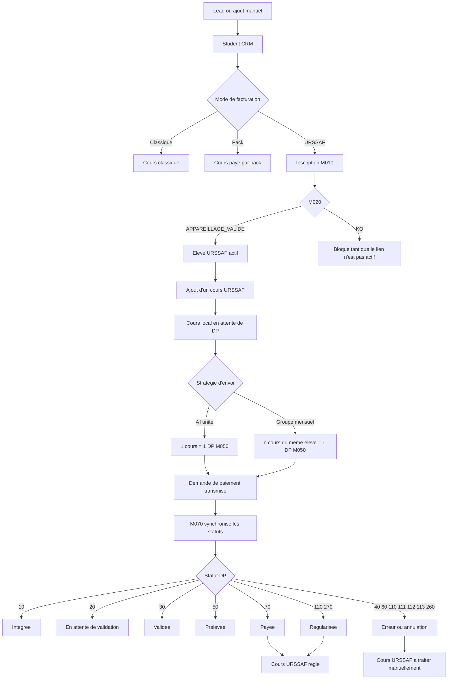
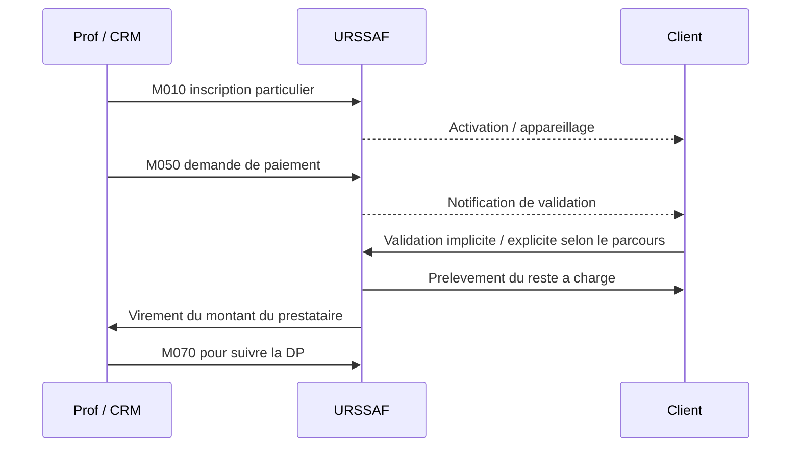
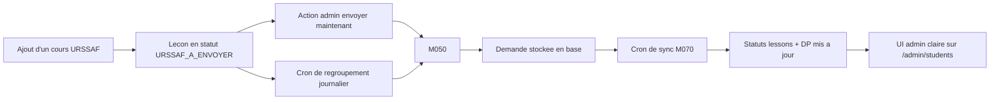

# Flux CRM + URSSAF

Ce document fixe le modele metier de l'admin unifie pour les eleves, les cours et l'Avance immediate.

## Principe

- Un eleve peut exister dans le CRM sans URSSAF.
- Un eleve peut etre inscrit a l'URSSAF via `M010`.
- Les cours URSSAF ne sont pas "payes" a la creation du cours.
- Une ou plusieurs lecons peuvent etre regroupees dans une demande de paiement `M050`.
- `M070` ne valide pas une lecon : il relit le statut d'une demande de paiement deja transmise.
- Un cours URSSAF ne doit etre considere comme regle qu'une fois la DP arrivee a un statut effectivement verse au prestataire.

## Vue d'ensemble

## Statuts locaux a afficher dans l'admin

### Niveau cours

- `DIRECT_REGLE` : cours classique deja encaisse directement.
- `PACK_REGLE` : cours paye par un pack.
- `MANUEL_A_REGLER` : cours local non regle.
- `URSSAF_A_ENVOYER` : cours URSSAF cree mais pas encore inclus dans une DP.
- `URSSAF_ENVOYE` : cours inclus dans une DP, statuts `10` ou `20`.
- `URSSAF_VALIDE` : DP validee (`30`).
- `URSSAF_PRELEVE` : DP prelevee (`50`).
- `URSSAF_REGLE` : DP payee (`70`, `120`, `270`).
- `URSSAF_ERREUR` : DP rejetee / annulee / impayee (`40`, `60`, `110`, `111`, `112`, `113`, `260`).

### Niveau demande de paiement

- Une demande de paiement stocke :
  - `numFactureTiers`
  - `idDemandePaiement`
  - `statutCode`
  - `statutLabel`
  - `amountTtc`
  - `dateDebutEmploi`
  - `dateFinEmploi`
  - `submittedAt`
  - `lastSyncedAt`
  - `rawLastResponse`

## Qui paye qui

## Regles produit retenues

- Le client ne doit plus etre marque comme "paye direct" pour un cours URSSAF.
- Les cours URSSAF restent distincts des cours classiques.
- Chaque cours URSSAF doit garder sa trace locale meme si la DP est groupee.
- Le groupement par defaut retenu est : **meme eleve + meme mois = 1 DP**.
- Une option "Envoyer ce cours seul" reste utile pour du debug ou des cas atypiques.
- Aucun webhook URSSAF n'est documente dans les elements officiels et la documentation locale verifiee ; la synchronisation doit donc partir sur un **polling M070**.

## Automatisation cible

## Decision d'implementation

- Stocker les demandes de paiement URSSAF en base Postgres.
- Lier chaque lecon a zero ou une demande de paiement URSSAF.
- Exposer dans la fiche eleve :
  - les cours URSSAF a envoyer
  - les demandes deja transmises
  - le dernier statut M070
- Ajouter un endpoint de synchronisation M070 appelable :
  - manuellement depuis l'admin
  - automatiquement par cron serveur
